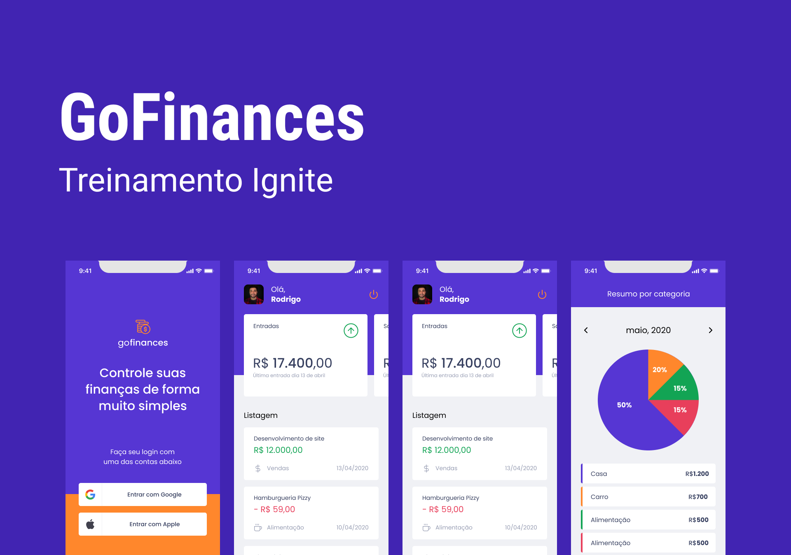

## 💻 Projeto

O projeto 'GoFinances' é uma aplicação que tem como objetivo auxiliar o usuário com um controle financeiro, ajudando a gerenciar as saídas e entradas de dinheiro.

  

## 🚀 Tecnologias

Esse projeto foi desenvolvido com as seguintes tecnologias:

* React Native
* Expo Bare Workflow
* TypeScript
* Styled Components
* Async Storage
* React Navigation
* React Hook Form
* Yup
